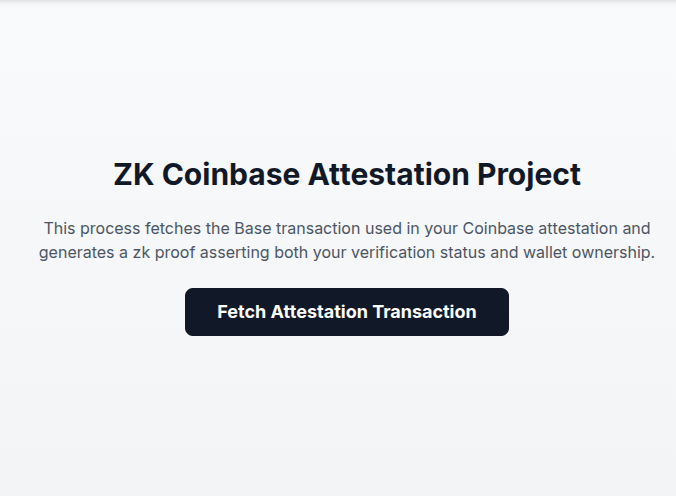

<p align="center">
  
</p>

<h1 align="center">ZK Coinbase Attestation</h1>

<p align="center">
  A zero-knowledge proof system to privately prove your Coinbase KYC status using Noir.
</p>

---

## 🔍 What It Does

ZK Coinbase Attestation allows users to **prove they've completed Coinbase KYC** without revealing their wallet address or onchain history. 

This is useful for:
- Accessing **compliant DeFi** products.
- Proving **personhood** privately.
- Gaining **exclusive perks** while preserving privacy.

---

## 🧪 How It Works

We leverage **onchain attestations** made by Coinbase using the [Ethereum Attestation Service (EAS)](https://base.easscan.org/schema/view/0xf8b05c79f090979bf4a80270aba232dff11a10d9ca55c4f88de95317970f0de9).

Instead of storage proofs, we verify that:
1. A privileged Coinbase account called `attestAccount(userAddress)`
2. The transaction was signed correctly by Coinbase
3. The user owns the wallet that was attested

All this happens in a Noir circuit with sub-4 second proving time.

---

## 🔧 Circuit Logic (Noir)

```rust
mod utils;
use utils::{concat_nonce_and_timestamp, concat_prefix_and_digest, extract_address_from_calldata};
use dep::ecrecover::ecrecover;
use dep::keccak256::keccak256;


global HARDCODED_SELECTOR: [u8; 4] = [86, 254, 237, 94];
global ETH_PREFIX_BYTES: [u8; 28] = [
    25, 69, 116, 104, 101, 114, 101, 117,
    109, 32, 83, 105, 103, 110, 101, 100,
    32, 77, 101, 115, 115, 97, 103, 101,
    58, 10, 51, 50
];


// This is the main circuit logic for verifying a Coinbase-style ZK attestation.
// It checks that both the attester (e.g., Coinbase) and the user have signed expected messages using ECDSA.
fn main(
    attester_pub_key_x: [u8; 32],
    attester_pub_key_y: [u8; 32],
    attester_signature: [u8; 64],
    hashed_attestation_tx: pub [u8; 32],
    expected_attester: pub Field,
    user_pub_key_x: [u8; 32],
    user_pub_key_y: [u8; 32],
    user_signature: [u8; 64],
    nonce_hash: pub [u8; 32],
    timestamp_hash: pub [u8; 32],
    tx_calldata: [u8; 36],
) {
    // Recover the Ethereum address from the attester's public key and signature over the attestation hash.
    // This proves that the attestation was genuinely signed by the trusted attester (e.g., Coinbase).
    let attester_addr = ecrecover(
        attester_pub_key_x,
        attester_pub_key_y,
        attester_signature,
        hashed_attestation_tx,
    );
    // Ensure the recovered attester address matches the expected one provided publicly.
    // This prevents malicious signatures from unauthorized attesters.
    assert(attester_addr == expected_attester);

    // Generate a unique hash from the nonce and timestamp to ensure freshness.
    // This prevents replay attacks by making each signature unique and tied to a specific session.
    // The hash is prefixed following Ethereum's personal_sign format, then hashed again to produce the final signed message.
    let pre_digest = concat_nonce_and_timestamp(nonce_hash, timestamp_hash);
    let digest = keccak256(pre_digest, 64);

    let message = concat_prefix_and_digest(ETH_PREFIX_BYTES, digest);
    let signed_user_hash = keccak256(message, 60);

    // Recover the user's Ethereum address from their public key and signature over their identity hash.
    // This shows that the user claims ownership of a particular address (e.g., for KYC or eligibility proofs).
    let user_addr = ecrecover(
        user_pub_key_x,
        user_pub_key_y,
        user_signature,
        signed_user_hash,
    );

    // Compare the selector to the expected function selector bytes
    for i in 0..4 {
        assert(tx_calldata[i] == HARDCODED_SELECTOR[i]);
    }

    // Extract the user address from the calldata (last 20 bytes)
    let extracted_addr = extract_address_from_calldata(tx_calldata);

    // Ensure the recovered user address matches the expected address.
    // This binds the user's signature to their identity in the attestation process.
    assert(user_addr == extracted_addr);
}
```

---

## 🖥️ Web UI Flow

- Connect your wallet
- Fetch your Coinbase attestation via EAS
- Locate the attestation transaction
- Generate a fresh zkProof
- Use the proof in any integrated dApp

---

## 🧱 Tech Stack

- **Frontend**: Vite, Wagmi, Tailwind
- **ZK Circuit**: Noir
- **Onchain Data**: [Base Explorer](https://basescan.org)

---

## 🚀 Getting Started

```bash
git clone https://github.com/lucholeonel/zk-coinbase-attestation-project
cd zk-coinbase-attestation-project

# Frontend
cd frontend
cp .env.example .env
npm install
npm run dev
```


> ⚠️ You'll need an API key from [BaseScan](https://docs.basescan.org/) to query transaction data.
> Add it to your `.env` file as:
> ```bash
> VITE_PUBLIC_BASE_API_KEY=your_api_key_here
> ```

Visit `http://localhost:5174` and click "Fetch Attestation Transaction".

---

## 📁 Folder Structure

- `/frontend`: Web interface for proof generation
- `/frontend/circuit`: Noir circuit logic

---

## 📚 Key References

- [Coinbase Verifications GitHub](https://github.com/coinbase/verifications)
- [EAS Schema](https://base.easscan.org/schema/view/0xf8b05c79f090979bf4a80270aba232dff11a10d9ca55c4f88de95317970f0de9)
- [Coinbase Verifications Website](https://www.coinbase.com/en-gb/onchain-verify)

---

## 🤝 Credits

Built with ❤️ for the Elite NoirHacker Grant.